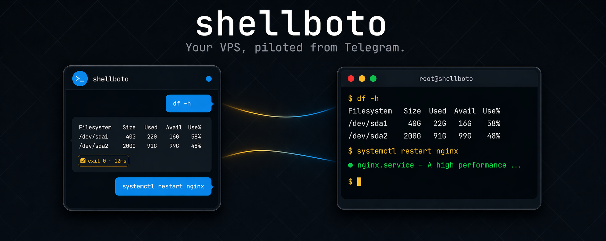
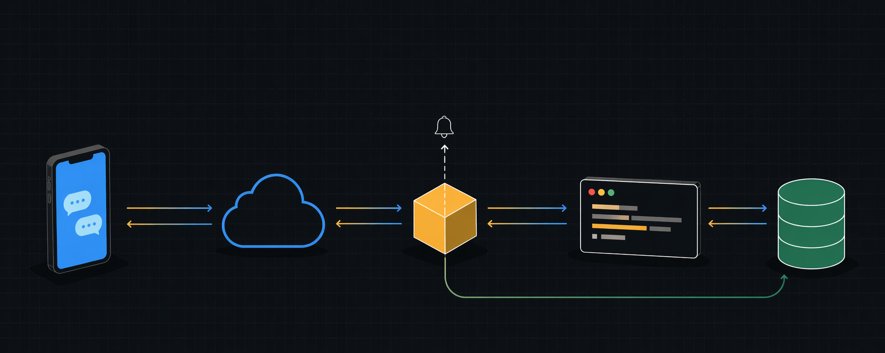

# shellboto

*Control your Linux VPS from Telegram. Auditable, self-hosted, one static binary.*

[](https://github.com/amiwrpremium/shellboto/actions/workflows/ci.yml)
[](https://github.com/amiwrpremium/shellboto/releases)
[](https://github.com/amiwrpremium/shellboto/actions/workflows/codeql.yml)
[](./go.mod)
[](https://goreportcard.com/report/github.com/amiwrpremium/shellboto)
[](./LICENSE)

> **Status: v0.1.x — early.** Stable for solo-operator use; config keys, CLI flags, and the audit-event schema may still shift before `1.0.0`. Semver goes strict at 1.0 — until then `feat` bumps patch and `feat!` bumps minor per `release-please-config.json`.

<p align="center">
  
</p>

A Telegram bot that gives whitelisted users a live shell on the VPS it runs on. Each user gets their own persistent bash (pty-backed, so `cd`, env vars, aliases, and job control all work). Command output streams live by editing a single message; output that exceeds the Telegram message cap spills to an attached `output.txt`.

User management and an audit log (with full captured output per command) are persisted in a local SQLite file.

> ⚠ **This is a remote shell bot running as root.** The whitelist is the only thing between a compromised Telegram account (yours or anyone you add) and full control of your VPS. Protect your Telegram account with 2FA and keep the user list tight.

## Table of contents

- [Quickstart](#quickstart)
- [Roles](#roles)
- [Features](#features)
- [Architecture](#architecture)
- [Why not just SSH?](#why-not-just-ssh)
- [User-facing commands](#user-facing-commands)
- [Build](#build)
- [CLI subcommands](#cli-subcommands)
- [Requirements](#requirements)
- [Install](#install)
- [Rollback](#rollback)
- [Uninstall](#uninstall)
- [Adding users after install](#adding-users-after-install)
- [Non-root shells for the `user` role](#non-root-shells-for-the-user-role)
- [Audit tamper-evidence](#audit-tamper-evidence)
- [Development](#development)
- [Documentation](#documentation)
- [Known limitations](#known-limitations)
- [Acknowledgments](#acknowledgments)
- [Related projects](#related-projects)
- [Security](#security)
- [Disclaimer](#disclaimer)

## Quickstart

Install + start in a few commands on a Debian/Ubuntu VPS:

```bash
# Pick the latest linux_amd64.deb from the releases page, then:
sudo apt install ./shellboto_<VERSION>_linux_amd64.deb
sudo vi /etc/shellboto/env       # paste SHELLBOTO_TOKEN + SHELLBOTO_SUPERADMIN_ID + SHELLBOTO_AUDIT_SEED
sudo systemctl enable --now shellboto
shellboto doctor                  # all-green preflight
```

Send `/start` to your bot on Telegram, then type any shell command.

Latest builds: [**Releases**](https://github.com/amiwrpremium/shellboto/releases) (amd64 + arm64, .deb / .rpm / tar.gz, SBOMs, checksums). Full step-by-step: [docs/getting-started/quickstart.md](docs/getting-started/quickstart.md).

## Roles

- **superadmin** — singleton, seeded from `SHELLBOTO_SUPERADMIN_ID` in the env file. Can do everything. Row is reseeded on every startup; edit the env and restart to change.
- **admin** — can add/remove users (not other admins), see everyone's audit log.
- **user** — shell access + own audit history.

## Features

- Plain text → sent to your shell.
- `/cancel` sends SIGINT (Ctrl+C); `/kill` sends SIGKILL to the foreground pgid.
- `/status`, `/reset`.
- `/get <path>` downloads a file from the VPS.
- Attach a file (paperclip → File) to upload it to your shell's cwd (or the path in the caption).
- Dangerous commands (`rm -rf`, `dd of=/dev/*`, `shutdown`, `reboot`, `mkfs.*`, piping to shell, etc.) require tapping ✅ Run on the warning message within 60s.
- Full audit log with gzipped output blob per command; 90-day auto-prune.
- Configurable default timeout, idle-shell reaping, heartbeat.

## Architecture

A Telegram message reaches shellboto, authenticates against the whitelist, dispatches into a per-user pty-backed bash, streams output back by editing the original message, and writes a hash-chained audit row for every command.

<p align="center">
  
</p>

Deep dive: [docs/architecture/overview.md](docs/architecture/overview.md).

## Why not just SSH?

- **Audit trail built in.** Every command, exit code, and full output is stored hash-chained in SQLite — you can replay exactly what happened, detect tampering, and prune on a schedule.
- **Phone-only operation.** 2FA Telegram is your entire prerequisite. No VPN, no SSH client install on a new device, no private key to carry, no bastion host.
- **Danger-prompt safety net.** 25 built-in regexes flag destructive patterns (`rm -rf /`, `dd of=/dev/sda`, pipe-to-shell, etc.); execution requires tapping ✅ Run within 60s.
- **Team-shareable without key distribution.** Whitelist is by Telegram ID; separate `user` and `admin` roles with RBAC; promote/demote is two taps instead of rotating an `authorized_keys`.
- **Live output streaming.** Long-running commands update the same Telegram message as output arrives — no waiting for the full run to finish before seeing the first line.
- **Per-command containment.** Timeout + output-size caps + auto-SIGKILL on overflow — a runaway process can't OOM the box.

Use SSH when you need full TTY (`vim`, `top`), port forwards, X11, or `scp` of giant files. Use shellboto when you want a traceable, phone-accessible "send command, see result" loop with auditability baked in.

## User-facing commands

Everyone: `plain text`, `/cancel`, `/kill`, `/status`, `/reset`, `/auditme`, `/start`, `/help`.

Admin+ only: `/users`, `/adduser <id> [user|admin]`, `/deluser <id>`, `/audit [N]`, `/audit-out <id>`.

Superadmin only: `/role <id> <user|admin>`.

## Build

```
cd /root/shellboto
make build              # bin/shellboto with version stamp
make build-stripped     # smaller binary (no debug symbols)
make version            # build + print the embedded version info
```

Plain `go build` also works but the resulting binary reports
`version=dev`. Use the Makefile for anything going to a real deploy
so the `--version` flag shows a proper git sha and build timestamp.

Pure Go — no CGO. The binary is self-contained.

### Other Makefile targets

```
make test       # full test suite
make vet        # go vet
make vuln       # govulncheck against dependency CVEs
make tarball    # project tarball at ../shellboto.tar.gz
make clean      # rm bin/
make help-cli   # build + print the CLI help text
make help       # list all targets
```

## CLI subcommands

The same binary that runs as the bot also exposes an ops CLI. Anything
you used to do by messaging the bot (audit verify, user list, …) or by
stopping the service (DB backup, vacuum) can be done directly:

```
shellboto doctor                        # preflight: config + env + paths + perms
shellboto config check [path]           # validate a config file without starting
shellboto audit verify                  # walk the hash chain
shellboto audit search --limit 20       # recent events (flags: --user, --kind, --since)
shellboto audit export --format json    # stream events as JSONL (or --format csv)
shellboto db backup /tmp/snap.db        # online SQLite backup via VACUUM INTO
shellboto db info                       # file size, row counts, pragma stats
shellboto db vacuum                     # reclaim space (refuses while service is running)
shellboto users list                    # everyone on the whitelist + promoted_by
shellboto simulate "rm -rf /"           # dry-run the danger matcher
shellboto mint-seed                     # fresh 32-byte hex for SHELLBOTO_AUDIT_SEED
shellboto completion bash               # shell completion (bash|zsh|fish)
```

Running with no subcommand (or with `-config` / `-version`) starts the
bot as before — the systemd unit is unaffected. Every subcommand accepts
`-config <path>` (default `/etc/shellboto/config.toml`) and
`SHELLBOTO_TOKEN` / `SHELLBOTO_SUPERADMIN_ID` must be set the same way
as for the service.

## Requirements

- **OS**: Linux, `amd64` or `arm64`. macOS binaries cover the CLI subcommands (`audit verify`, `db backup`, etc.); the bot itself is Linux-only (uses pty + Linux-specific `Credential{Uid}` and ioctl syscalls).
- **Service manager**: systemd preferred. OpenRC / runit / s6 init scripts included under `deploy/init/` for non-systemd hosts.
- **systemd 250+** — only needed for the optional encrypted-at-rest secrets mode via `deploy/enable-credentials.sh`.
- **Go 1.26+** — only needed if you build from source. Pre-built `.deb` / `.rpm` / tar.gz / Homebrew cover most cases.
- **Network**: outbound HTTPS to `api.telegram.org`. **No inbound ports.**
- **Disk**: ~30 MiB binary + a growing SQLite audit DB (typical solo use stays under 100 MiB; see `audit_retention` + `audit_max_blob_bytes` for tuning).

## Install

One command:

```
sudo ./deploy/install.sh
```

Interactive — prompts for the bot token (input hidden, never echoed),
your Telegram user ID (the superadmin), and picks TOML/YAML/JSON for
the config. Auto-generates a fresh 32-byte audit seed. Installs the
binary to `/usr/local/bin`, config under `/etc/shellboto`, the systemd
unit, then runs `shellboto doctor` before exiting so you see a green
preflight.

Re-run the same script after `make build` to upgrade — it detects
existing env/config, keeps your values, replaces the binary, and
restarts the service.

For CI / Ansible, pass `-y` with the required env vars:

```
sudo SHELLBOTO_TOKEN=... ./deploy/install.sh -y --superadmin-id 123456789
```

See `deploy/README.md` for all flags and safety notes.

<details>
<summary>Manual install (if you need to place files by hand)</summary>

```
install -m 0755 bin/shellboto /usr/local/bin/shellboto
install -d -m 0700 /etc/shellboto
install -m 0600 deploy/env.example         /etc/shellboto/env
install -m 0600 deploy/config.example.toml /etc/shellboto/config.toml
# or deploy/config.example.yaml → /etc/shellboto/config.yaml
# or deploy/config.example.json → /etc/shellboto/config.json
# extension drives the parser (.toml / .yaml / .yml / .json)
install -m 0644 deploy/shellboto.service   /etc/systemd/system/
# edit the token + SHELLBOTO_SUPERADMIN_ID + SHELLBOTO_AUDIT_SEED in
# /etc/shellboto/env  (use `openssl rand -hex 32` for the seed)
systemctl daemon-reload
systemctl enable --now shellboto
journalctl -u shellboto -f
```

The service uses `StateDirectory=shellboto` so systemd creates `/var/lib/shellboto` at start; the SQLite file lives at `/var/lib/shellboto/state.db` (chmod 0600 on open).

</details>

## Rollback

```
sudo ./deploy/rollback.sh
```

The installer keeps a copy of the previous binary at
`/usr/local/bin/shellboto.prev` on every upgrade. `rollback.sh` swaps
current ↔ previous via atomic renames (service stopped for the swap,
started after). Reversible — re-run to toggle back to the newer
version. Fresh installs have nothing to roll back to and the script
refuses with a clear message.

## Uninstall

```
sudo ./deploy/uninstall.sh
```

Safe by default: removes the binary + systemd unit, **keeps** your
config and the audit DB. Pass `--remove-config` / `--remove-state` to
delete them too — the DB deletion requires typing a confirmation
phrase interactively (or the `--i-understand-this-deletes-audit-log`
flag in `-y` mode) so a stray yes-to-everything can't wipe audit
history.

## Adding users after install

1. Make sure `SHELLBOTO_SUPERADMIN_ID` in `/etc/shellboto/env` is your Telegram user ID. Restart the service — the superadmin row is seeded automatically.
2. Message the bot from that account to confirm it responds.
3. Use `/adduser <telegram_id>` to onboard additional users. They'll be `role=user` by default. To promote someone to admin, use `/role <telegram_id> admin` (superadmin only).

### Finding a Telegram user ID

Either ask the person to message `@userinfobot`, or have them message your bot: even rejected messages land in `audit_events` with kind `auth_reject`, and you can read the ID out of `journalctl -u shellboto` or the audit log.

## Non-root shells for the `user` role

By default (empty `user_shell_user` in config), **every** pty shell runs as
root, including shells for accounts with role `user`. That matches the
original "control the whole system" project brief but is not what you
want if you invite junior devs / ops people onto the bot.

To make `user`-role shells actually non-root:

```bash
# 1) Create an unprivileged account with no sudo powers
useradd --system --shell /bin/bash shellboto-user

# 2) Base home dir the bot creates per-telegram-user subdirs under.
#    MUST be root-owned — if shellboto-user could write here, they
#    could pre-plant a symlink (e.g. /home/shellboto-user/<tid> → /etc)
#    that would redirect the bot's subsequent chown to a system path,
#    escalating shellboto-user to root. 0750 with group=shellboto-user
#    lets the shell user traverse into their own <tid>/ subdir, which
#    the bot creates and chowns to them at spawn time.
mkdir -p /home/shellboto-user
chown root:shellboto-user /home/shellboto-user
chmod 0750 /home/shellboto-user

# 3) Verify no sudoers entries
sudo -l -U shellboto-user     # should say: "User shellboto-user is not allowed to run sudo"

# 4) Point the bot at it
grep -q '^user_shell_user' /etc/shellboto/config.toml \
  && sed -i 's|^user_shell_user.*|user_shell_user = "shellboto-user"|' /etc/shellboto/config.toml \
  || echo 'user_shell_user = "shellboto-user"' >> /etc/shellboto/config.toml

systemctl restart shellboto
journalctl -u shellboto -e | grep 'user-role shells resolved'
```

After this, a role=`user` account typing `whoami` gets `shellboto-user`,
`cat /etc/shadow` gets Permission denied, `apt-get install …` fails with
a permission error. admin+ shells stay root.

Active shells keep their original credentials; run `/reset` to respawn
under new settings (the bot also auto-resets the target on promote/demote).

## Audit tamper-evidence

Every audit row carries a hash chain (`prev_hash` + `row_hash`), computed as
`sha256(prev_hash || canonical(row))`. The first row in the DB links to
a genesis seed taken from `SHELLBOTO_AUDIT_SEED` (32 bytes hex). An
attacker who edits or deletes rows in the DB breaks the chain; an admin
can detect that with:

```
/audit-verify
```

Output is either `✅ audit chain OK — N rows verified.` or
`❌ audit chain BROKEN` with the first bad row id and reason.

In parallel, every audit event is mirrored as a structured Info-level
log line on the `audit` zap logger (journald captures it). So an
attacker who wipes the DB still leaves a trail in the system journal,
and vice versa — they need to corrupt both to hide tracks.

Generate and install the seed once:

```bash
# Mint a fresh 32-byte seed
openssl rand -hex 32
# Paste the hex into /etc/shellboto/env:
SHELLBOTO_AUDIT_SEED=<paste-here>
systemctl restart shellboto
```

Without the seed set, the bot warns at startup and falls back to an
all-zeros seed (acceptable for dev, not for production).

## Development

See [CONTRIBUTING.md](./CONTRIBUTING.md) for the full workflow.
Short version:

```bash
./scripts/install-dev-tools.sh     # lefthook, golangci-lint, goreleaser, ...
make hooks-install                 # wire Git hooks
make test                          # go test ./...
make lint                          # golangci-lint
make release-snapshot              # local dry-run of goreleaser
```

Commit messages follow [Conventional Commits](https://www.conventionalcommits.org/).
Releases are driven by [release-please](https://github.com/googleapis/release-please):
land commits on `master` → release-please opens a PR that bumps the
version + writes `CHANGELOG.md` → merge the PR → it tags
automatically → `release.yml` runs goreleaser (cross-platform
binaries, .deb/.rpm, Homebrew tap push, GitHub release).

## Documentation

The full [`docs/`](docs/) tree — every subdirectory has its own `README.md` landing page:

- **[Getting started](docs/getting-started/)** — quickstart, @BotFather walkthrough, finding a Telegram user ID, first install, first commands.
- **[Configuration](docs/configuration/)** — formats, [full schema with every key + default](docs/configuration/schema.md), environment variables, roles, non-root shells, timeouts, audit-output modes.
- **[Architecture](docs/architecture/)** — overview, stack, project layout, package graph, runtime model, data flow, concurrency model, design decisions.
- **[Security](docs/security/)** — threat model, whitelist + RBAC, audit hash chain, seed management, **full danger-matcher regex table**, secret redaction, rate limiting, secrets-at-rest modes.
- **[Shell](docs/shell/)** — pty vs. exec, fd-3 control pipe, output buffer, signal handling, user-shell drop-privs.
- **[Audit](docs/audit/)** + **[Database](docs/database/)** — schema, kinds, hash-chain deep dive, retention, all `shellboto audit …` CLI subcommands, backup / restore / vacuum.
- **[Telegram](docs/telegram/)** — slash commands, callbacks + flows, streaming output, supernotify, file transfer.
- **[Deployment](docs/deployment/)** — installer, systemd / OpenRC / runit / s6, uninstall, rollback, [production checklist](docs/deployment/production-checklist.md).
- **[Operations](docs/operations/)** — doctor, logs, heartbeat + idle-reap, user management, updating, monitoring.
- **[Development](docs/development/)** — prerequisites, build from source, hooks, linting, commit messages, testing, CI, releasing.
- **[Packaging](docs/packaging/)** — goreleaser, .deb/.rpm, Homebrew, SBOMs, verifying downloads.
- **[Runbooks](docs/runbooks/)** — bad release, token leak, audit chain broken, DB corruption, shell stuck, disk full.
- **[Troubleshooting](docs/troubleshooting/)** — installer fails, bot not responding, commands never complete, audit verify fails, error-message lookup.
- **[Reference](docs/reference/)** — [CLI](docs/reference/cli.md), [Telegram commands](docs/reference/telegram-commands.md), [env vars](docs/reference/env-vars.md), [config keys](docs/reference/config-keys.md), [audit kinds](docs/reference/audit-kinds.md), [danger patterns](docs/reference/danger-patterns.md), [file paths](docs/reference/file-paths.md), [exit codes](docs/reference/exit-codes.md).
- **[FAQ](docs/faq.md)** — recurring questions (is this safe? why pty? why doesn't `vim` work? Docker? auditing; rotation; …).

## Known limitations

- Interactive full-screen programs (`vim`, `top`, `less`) won't render usefully — Telegram isn't a terminal. Use `cat`, `tail`, `ps`, `htop -n 1`, etc.
- Backgrounded jobs (`sleep 100 &`) free up the prompt immediately; their later stdout mixes into the next command's output.
- Shell state is lost on idle-reap (default 1h), `/reset`, or service restart — by design.
- `exec bash` / `exec sh` (re-execing the shell in place) wedges boundary detection: the new shell image doesn't inherit our `PROMPT_COMMAND` dispatcher, so the next command never signals completion. The bot's per-command timeout (default 5m) eventually fires and the reaper cleans up. Run `/reset` for an immediate recovery.
- Telegram's bot-API file limit is 50 MB for both `/get` and uploads.
- Full command output is stored in the audit DB. If your commands spit out secrets in logs, those secrets end up on disk. Filesystem perms 0600 are the only protection.

## Acknowledgments

shellboto stands on the shoulders of these:

- **[`creack/pty`](https://github.com/creack/pty)** — pty + fork-exec plumbing that makes the persistent-bash-per-user model possible.
- **[`go-telegram/bot`](https://github.com/go-telegram/bot)** — actively-maintained, typed Telegram Bot API client with first-class context support.
- **[GORM](https://gorm.io)** + **[`modernc.org/sqlite`](https://gitlab.com/cznic/sqlite)** — pure-Go SQLite (no CGO) keeps the binary static + cross-compile trivial.
- **[zap](https://pkg.go.dev/go.uber.org/zap)** — structured logging, including the `audit`-named child logger that mirrors every audit event to journald.
- **[goreleaser](https://goreleaser.com)** + **[release-please](https://github.com/googleapis/release-please)** — merge a PR, get binaries + `.deb` + `.rpm` + Homebrew formula + SBOMs + a GitHub Release automatically.
- **[lefthook](https://github.com/evilmartians/lefthook)**, **[golangci-lint](https://golangci-lint.run)**, **[gitleaks](https://github.com/gitleaks/gitleaks)**, **[govulncheck](https://pkg.go.dev/golang.org/x/vuln/cmd/govulncheck)**, **[syft](https://github.com/anchore/syft)** — the quality + release toolchain.

## Related projects

- **[macontrol](https://github.com/amiwrpremium/macontrol)** — same idea for macOS. Menu-first Telegram bot that controls your Mac (sound, brightness, wifi, power, screenshots, Shortcuts). Apple Silicon, Go, Homebrew. Where shellboto gives you a Linux shell, macontrol gives you a Mac remote.

## Security

Please **don't open a public issue** for security reports. Two channels:

- GitHub's [private vulnerability reporting](https://github.com/amiwrpremium/shellboto/security/advisories/new) (preferred — attaches the report to the repo, creates a private advisory).
- Email **amiwrpremium@gmail.com** directly.

I'll acknowledge within a few days, coordinate a fix, and credit you in the release notes unless you ask otherwise.

## Disclaimer

**shellboto is provided "AS IS", WITHOUT WARRANTY OF ANY KIND**, express or implied, including but not limited to the warranties of merchantability, fitness for a particular purpose, title, and noninfringement. See [LICENSE](./LICENSE) for the full MIT terms.

**You run shellboto entirely at your own risk.** By installing, operating, contributing to, or otherwise using this software, you accept that the author(s) and contributors have **no liability** for any loss, damage, compromise, downtime, or legal exposure arising from its use or misuse — including but not limited to:

- Data loss, data corruption, or unauthorised disclosure (including secrets that pass through command output and land in the audit blob).
- Compromise of the VPS or any system reachable from it.
- Financial loss, reputational harm, or regulatory penalties.
- Any action performed by a whitelisted user you or another admin added — intentional or accidental.
- Loss of access to your own server, account, or data.

shellboto **deliberately gives whitelisted Telegram users a live shell on your server**, typically running as root. That is the feature, not a bug. You alone are responsible for:

- Securing your Telegram account (2FA, recovery flow, device hygiene).
- Vetting every user you whitelist; promoting with care; revoking promptly.
- Protecting `/etc/shellboto/env` (or its `systemd-creds` replacement) and your audit seed.
- Backups, disaster recovery, and periodic `shellboto audit verify` runs.
- Patching the host, firewalling it, and otherwise operating the VPS.
- Understanding the built-in danger matcher's scope and its explicit limitations (see [docs/security/danger-matcher.md](docs/security/danger-matcher.md)).

If you do not accept these terms, do not install or run shellboto.
